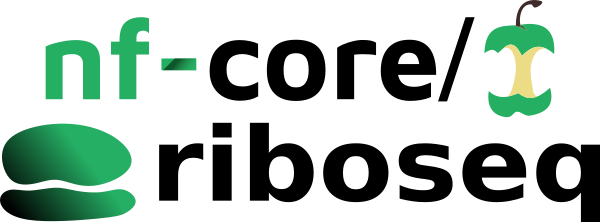
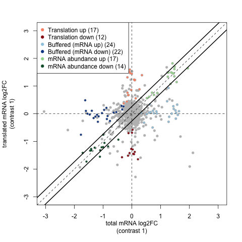

<h1>
  <picture>
    <source media="(prefers-color-scheme: dark)" srcset="docs/images/nf-core-riboseq_logo_dark.png">
    
  </picture>
</h1>

[](https://github.com/nf-core/riboseq/actions/workflows/ci.yml)
[](https://github.com/nf-core/riboseq/actions/workflows/linting.yml)[](https://nf-co.re/riboseq/results)[](https://doi.org/10.5281/zenodo.10966365)
[](https://www.nf-test.com)

[](https://www.nextflow.io/)
[](https://docs.conda.io/en/latest/)
[](https://www.docker.com/)
[](https://sylabs.io/docs/)
[](https://tower.nf/launch?pipeline=https://github.com/nf-core/riboseq)

[](https://nfcore.slack.com/channels/riboseq)[](https://twitter.com/nf_core)[](https://mstdn.science/@nf_core)[](https://www.youtube.com/c/nf-core)

## Introduction

**nf-core/riboseq** is a bioinformatics pipeline for analysis of Ribo-seq data. It borrows heavily from nf-core/rnaseq in the preprocessing stages:

1. Merge re-sequenced FastQ files ([`cat`](http://www.linfo.org/cat.html))
2. Sub-sample FastQ files and auto-infer strandedness ([`fq`](https://github.com/stjude-rust-labs/fq), [`Salmon`](https://combine-lab.github.io/salmon/))
3. Read QC ([`FastQC`](https://www.bioinformatics.babraham.ac.uk/projects/fastqc/))
4. UMI extraction ([`UMI-tools`](https://github.com/CGATOxford/UMI-tools))
5. Adapter and quality trimming ([`Trim Galore!`](https://github.com/FelixKrueger/TrimGalore))
6. Removal of genome contaminants ([`BBSplit`](http://seqanswers.com/forums/showthread.php?t=41288))
7. Removal of ribosomal RNA ([`SortMeRNA`](https://github.com/biocore/sortmerna))
8. Genome alignment of reads, outputting both genome and transcriptome alignments with [`STAR`](https://github.com/alexdobin/STAR)
9. Sort and index alignments ([`SAMtools`](https://sourceforge.net/projects/samtools/files/samtools/))
10. UMI-based deduplication ([`UMI-tools`](https://github.com/CGATOxford/UMI-tools))

Differences occur in the downstream analysis steps. Currently these specialist steps are:

1. Check reads distribution around annotated protein coding regions on user provided transcripts, show frame bias and estimate P-site offset for different group of reads ([`Ribo-TISH`](https://github.com/zhpn1024/ribotish))
2. (default, optional) Predict translated open reading frames and/ or translation initiation sites _de novo_ from alignment data ([`Ribo-TISH`](https://github.com/zhpn1024/ribotish))
3. (default, optional) Derive candidate ORFs from reference data and detect translated ORFs from that list ([`Ribotricer`](https://github.com/smithlabcode/ribotricer))
4. (optional) Use a translational efficiency approach to study the dynamics of transcription and translation, with [anota2seq](https://bioconductor.org/packages/release/bioc/html/anota2seq.html). **requires matched RNA-seq and Ribo-seq data**

## Usage

> [!NOTE]
> If you are new to Nextflow and nf-core, please refer to [this page](https://nf-co.re/docs/usage/installation) on how to set-up Nextflow. Make sure to [test your setup](https://nf-co.re/docs/usage/introduction#how-to-run-a-pipeline) with `-profile test` before running the workflow on actual data.

First, prepare a samplesheet with your input data that looks as follows:

`samplesheet.csv`:

```csv
sample,fastq_1,fastq_2,strandedness,type
CONTROL_REP1,AEG588A1_S1_L002_R1_001.fastq.gz,AEG588A1_S1_L002_R2_001.fastq.gz,forward,riboseq
```

Each row represents a fastq file (single-end) or a pair of fastq files (paired end). Each row should have a 'type' value of `riboseq`, `tiseq` or `rnaseq`. Future iterations of the workflow will conduct paired analysis of matched riboseq and rnaseq samples to accomplish analysis types such as 'translational efficiency, but in the current version you should set this to `riboseq` or `tiseq` for reglar Ribo-seq or TI-seq data respectively.

Now, you can run the pipeline using:

```bash
nextflow run nf-core/riboseq \
   -profile <docker/singularity/.../institute> \
   --input samplesheet.csv \
   --outdir <OUTDIR>
```

### Including a translational efficiency analysis



In the translational efficiency analysis provided by [anota2seq](https://bioconductor.org/packages/release/bioc/html/anota2seq.html), we use matched pairs of Ribo-seq and RNA-seq data to study the relationship between transcription and translation as they differ between two treatment groups. For example the test data for this workflow has a contrasts file like:

```csv
id,variable,reference,target,batch,pair
treated_vs_control,treatment,control,treated,,pair
```

This describes how to compare groups of samples between treament groups, and between RNA-seq and Ribo-seq. In order the columns are:

- `id`: a unique identifier to use for the contrast
- 'variable`: which vaiable (column) of the sample sheet should be used to separate the treatment groups?
- `reference`: which value of the variable column should be used to select samples to be used as the reference/ base group?
- `target`: which value of the variable column should be used to select samples to be used as the target/treated group?
- `batch`: (optional) specify a variable in the sample sheet that defines sample batches
- `pair`: (optional) specify a variable in the sample shet that defines sample pairing between RNA-seq and Ribo-seq samples. If not specified, it is assumed that the two types of sample are ordered the same.

> [!WARNING]
> Please provide pipeline parameters via the CLI or Nextflow `-params-file` option. Custom config files including those provided by the `-c` Nextflow option can be used to provide any configuration _**except for parameters**_;
> see [docs](https://nf-co.re/usage/configuration#custom-configuration-files).

For more details and further functionality, please refer to the [usage documentation](https://nf-co.re/riboseq/usage) and the [parameter documentation](https://nf-co.re/riboseq/parameters).

## Pipeline output

To see the results of an example test run with a full size dataset refer to the [results](https://nf-co.re/riboseq/results) tab on the nf-core website pipeline page.
For more details about the output files and reports, please refer to the
[output documentation](https://nf-co.re/riboseq/output).

## Credits

nf-core/riboseq was originally written by [Jonathan Manning](https://github.com/pinin4fjords) (Bioinformatics Engineer at Seqera) with support from [Altos Labs](https://www.altoslabs.com/) and in discussion with [Felix Krueger](https://github.com/FelixKrueger) and [Christel Krueger](https://github.com/ChristelKrueger). We thank the following people for their input:

- Anne Bresciani (ZS)
- [Felipe Almeida](https://github.com/fmalmeida) (ZS)
- [Mikhail Osipovitch](https://github.com/mosi223) (ZS)
- [Edward Wallace](https://github.com/ewallace) (University of Edinburgh)
- [Jack Tierney](https://github.com/JackCurragh) (University College Cork)
- [Maxime U Garcia](https://github.com/maxulysse) (Seqera)

## Contributions and Support

If you would like to contribute to this pipeline, please see the [contributing guidelines](.github/CONTRIBUTING.md).

For further information or help, don't hesitate to get in touch on the [Slack `#riboseq` channel](https://nfcore.slack.com/channels/riboseq) (you can join with [this invite](https://nf-co.re/join/slack)).

## Citations

If you use nf-core/riboseq for your analysis, please cite it using the following doi: [10.5281/zenodo.10966365](https://doi.org/10.5281/zenodo.10966365)

An extensive list of references for the tools used by the pipeline can be found in the [`CITATIONS.md`](CITATIONS.md) file.

You can cite the `nf-core` publication as follows:

> **The nf-core framework for community-curated bioinformatics pipelines.**
>
> Philip Ewels, Alexander Peltzer, Sven Fillinger, Harshil Patel, Johannes Alneberg, Andreas Wilm, Maxime Ulysse Garcia, Paolo Di Tommaso & Sven Nahnsen.
>
> _Nat Biotechnol._ 2020 Feb 13. doi: [10.1038/s41587-020-0439-x](https://dx.doi.org/10.1038/s41587-020-0439-x).
