# nf-core/riboseq: Output

## Introduction

This document describes the output produced by the pipeline. Most of the plots are taken from the MultiQC report generated from the [full-sized test dataset](https://github.com/nf-core/test-datasets/tree/riboseq#full-test-dataset-origin) for the pipeline using a command similar to the one below:

```bash
nextflow run nf-core/riboseq -profile test_full,<docker/singularity/institute>
```

The directories listed below will be created in the results directory after the pipeline has finished. All paths are relative to the top-level results directory.

## Pipeline overview

The pipeline is built using [Nextflow](https://www.nextflow.io/) and processes data using the following steps:

- [nf-core/riboseq: Output](#nf-coreriboseq-output)
  - [Introduction](#introduction)
  - [Pipeline overview](#pipeline-overview)
  - [Preprocessing](#preprocessing)
    - [cat](#cat)
    - [FastQC](#fastqc)
    - [UMI-tools extract](#umi-dedup)
    - [TrimGalore](#trimgalore)
    - [fastp](#fastp)
    - [BBSplit](#bbsplit)
    - [rRNA removal](#rrna-removal)
  - [Alignment](#alignment)
    - [STAR](#star)
  - [UMI-tools deduplication](#umi-tools-deduplication)
  - [Coverage tracks](#coverage-tracks)
  - [Riboseq-specific QC](#riboseq-specific-qc)
    - [Ribo-TISH quality](#ribo-tish-quality)
    - [Ribotricer detect-orfs QC outputs](#ribotricer-detect-orfs-qc-outputs)
    - [RiboCode metaplots](#ribocode-metaplots)
  - [ORF predictions](#orf-predictions)
    - [Ribo-TISH predict](#ribo-tish-predict)
    - [Ribotricer detect-orfs](#ribotricer-detect-orfs)
    - [RiboCode](#ribocode)
  - [P-site identification](#p-site-identification)
    - [riboWaltz](#ribowaltz)
    - [plastid](#plastid)
  - [Quantification](#quantification)
  - [Translational efficiency](#translational-efficiency)
    - [MultiQC](#multiqc)
  - [Workflow reporting and genomes](#workflow-reporting-and-genomes)
    - [Reference genome files](#reference-genome-files)
    - [Pipeline information](#pipeline-information)

## Preprocessing

### cat

<details markdown="1">
<summary>Output files</summary>

- `preprocessing/fastq/`
  - `*.merged.fastq.gz`: If `--save_merged_fastq` is specified, concatenated FastQ files will be placed in this directory.

</details>

If multiple libraries/runs have been provided for the same sample in the input samplesheet (e.g. to increase sequencing depth) then these will be merged at the very beginning of the pipeline in order to have consistent sample naming throughout the pipeline. Please refer to the [usage documentation](https://nf-co.re/riboseq/usage#samplesheet-input) to see how to specify these samples in the input samplesheet.

### fq lint

<details markdown="1">
<summary>Output files</summary>

- `fq_lint/*`
  - `*.fq_lint.txt`: Linting report per library from `fq lint`.

> **NB:** You will see subdirectories here based on the stage of preprocessing for the files that have been linted, for example `raw`, `trimmed`.

</details>

[fq lint](https://github.com/stjude-rust-labs/fq) runs several checks on input FASTQ files. It will fail with a non-zero error code when issues are found, which will terminate the workflow execution. In the absence of this, the successful linting produces the logs you will find here.

### FastQC

<details markdown="1">
<summary>Output files</summary>

- `preprocessing/fastqc/`
  - `*_fastqc.html`: FastQC report containing quality metrics.
  - `*_fastqc.zip`: Zip archive containing the FastQC report, tab-delimited data file and plot images.

> **NB:** The FastQC plots in this directory are generated relative to the raw, input reads. They may contain adapter sequence and regions of low quality. To see how your reads look after adapter and quality trimming please refer to the FastQC reports in the `trimgalore/fastqc/` directory.

</details>

[FastQC](http://www.bioinformatics.babraham.ac.uk/projects/fastqc/) gives general quality metrics about your sequenced reads. It provides information about the quality score distribution across your reads, per base sequence content (%A/T/G/C), adapter contamination and overrepresented sequences. For further reading and documentation see the [FastQC help pages](http://www.bioinformatics.babraham.ac.uk/projects/fastqc/Help/).

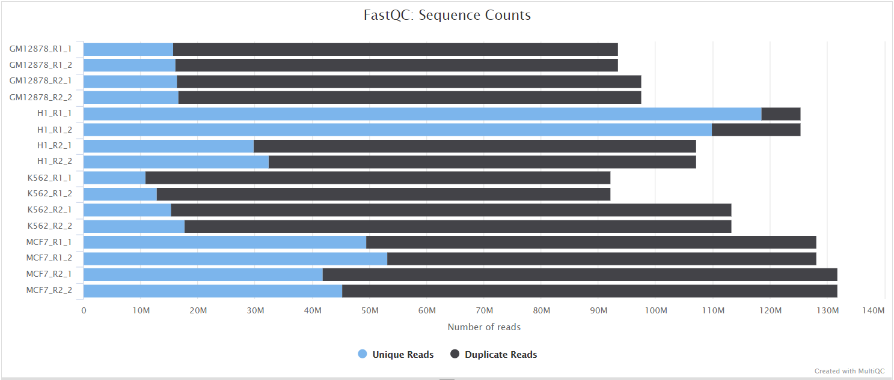

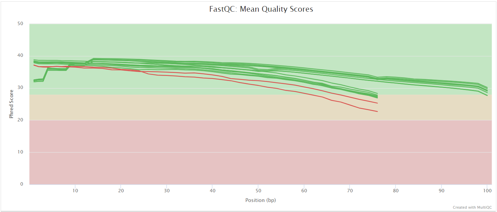

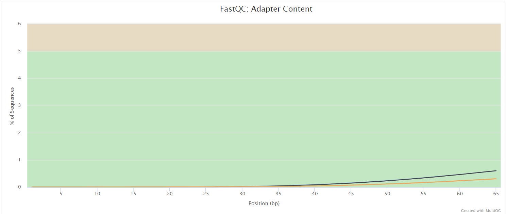

### UMI-tools extract

<details markdown="1">
<summary>Output files</summary>

- `umitools/`
  - `*.fastq.gz`: If `--save_umi_intermeds` is specified, FastQ files **after** UMI extraction will be placed in this directory.
  - `*.log`: Log file generated by the UMI-tools `extract` command.

</details>

[UMI-tools](https://github.com/CGATOxford/UMI-tools) and [UMICollapse](https://github.com/Daniel-Liu-c0deb0t/UMICollapse) deduplicate reads based on unique molecular identifiers (UMIs) to address PCR-bias. Firstly, the UMI-tools `extract` command removes the UMI barcode information from the read sequence and adds it to the read name. Secondly, reads are deduplicated based on UMI identifier after mapping as highlighted in the [UMI dedup](#umi-dedup) section.

To facilitate processing of input data which has the UMI barcode already embedded in the read name from the start, `--skip_umi_extract` can be specified in conjunction with `--with_umi`.

### TrimGalore

<details markdown="1">
<summary>Output files</summary>

- `preprocessing/trimgalore/`
  - `*.fq.gz`: If `--save_trimmed` is specified, FastQ files **after** adapter trimming will be placed in this directory.
  - `*_trimming_report.txt`: Log file generated by Trim Galore!.
- `preprocessing/trimgalore/fastqc/`
  - `*_fastqc.html`: FastQC report containing quality metrics for read 1 (_and read2 if paired-end_) **after** adapter trimming.
  - `*_fastqc.zip`: Zip archive containing the FastQC report, tab-delimited data file and plot images.

</details>

[Trim Galore!](https://www.bioinformatics.babraham.ac.uk/projects/trim_galore/) is a wrapper tool around Cutadapt and FastQC to peform quality and adapter trimming on FastQ files. Trim Galore! will automatically detect and trim the appropriate adapter sequence. It is the default trimming tool used by this pipeline, however you can use fastp instead by specifying the `--trimmer fastp` parameter. You can specify additional options for Trim Galore! via the `--extra_trimgalore_args` parameters.

> **NB:** TrimGalore! will only run using multiple cores if you are able to use more than > 5 and > 6 CPUs for single- and paired-end data, respectively. The total cores available to TrimGalore! will also be capped at 4 (7 and 8 CPUs in total for single- and paired-end data, respectively) because there is no longer a run-time benefit. See [release notes](https://github.com/FelixKrueger/TrimGalore/blob/master/Changelog.md#version-060-release-on-1-mar-2019) and [discussion whilst adding this logic to the nf-core/atacseq pipeline](https://github.com/nf-core/atacseq/pull/65).

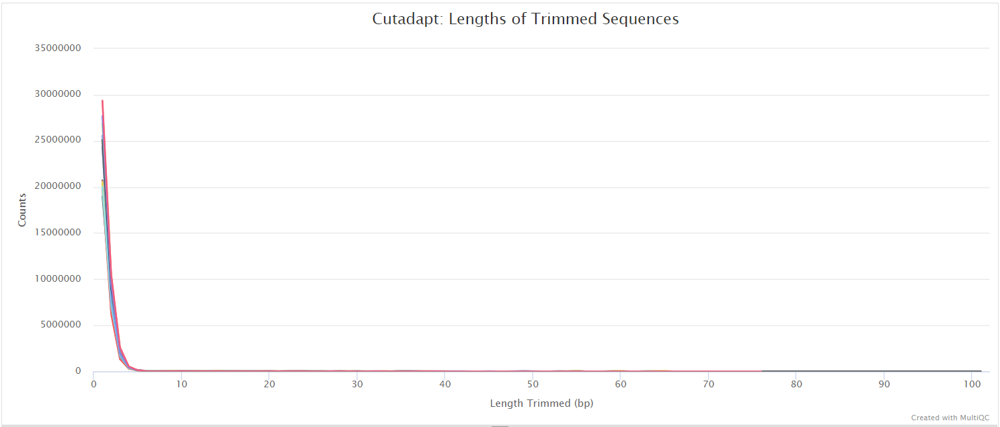

### fastp

<details markdown="1">
<summary>Output files</summary>

- `preprocessing/fastp/`
  - `*.fastq.gz`: If `--save_trimmed` is specified, FastQ files **after** adapter trimming will be placed in this directory.
  - `*.fastp.html`: Trimming report in html format.
  - `*.fastp.json`: Trimming report in json format.
- `preprocessing/fastp/log/`
  - `*.fastp.log`: Trimming log file.
- `preprocessing/fastp/fastqc/`
  - `*_fastqc.html`: FastQC report containing quality metrics for read 1 (_and read2 if paired-end_) **after** adapter trimming.
  - `*_fastqc.zip`: Zip archive containing the FastQC report, tab-delimited data file and plot images.

</details>

[fastp](https://github.com/OpenGene/fastp) is a tool designed to provide fast, all-in-one preprocessing for FastQ files. It has been developed in C++ with multithreading support to achieve higher performance. fastp can be used in this pipeline for standard adapter trimming and quality filtering by setting the `--trimmer fastp` parameter. You can specify additional options for fastp via the `--extra_fastp_args` parameter.

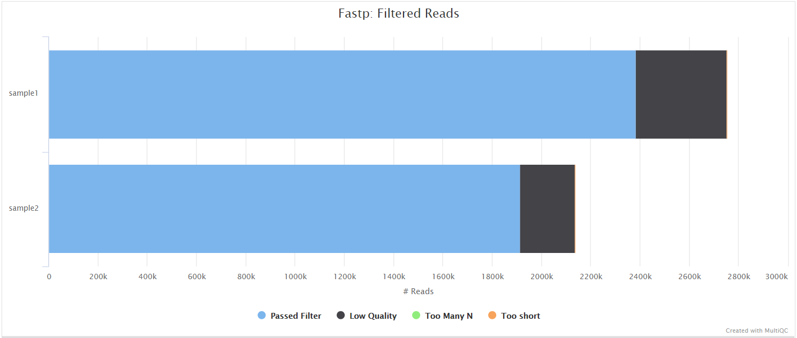

### BBSplit

<details markdown="1">
<summary>Output files</summary>

- `preprocessing/bbsplit/`
  - `*.fastq.gz`: If `--save_bbsplit_reads` is specified FastQ files split by reference will be saved to the results directory. Reads from the main reference genome will be named "_primary_.fastq.gz". Reads from contaminating genomes will be named "_<SHORT_NAME>_.fastq.gz" where `<SHORT_NAME>` is the first column in `--bbsplit_fasta_list` that needs to be provided to initially build the index.
  - `*.txt`: File containing statistics on how many reads were assigned to each reference.

</details>

[BBSplit](http://seqanswers.com/forums/showthread.php?t=41288) is a tool that bins reads by mapping to multiple references simultaneously, using BBMap. The reads go to the bin of the reference they map to best. There are also disambiguation options, such that reads that map to multiple references can be binned with all of them, none of them, one of them, or put in a special "ambiguous" file for each of them.

This functionality would be especially useful, for example, if you have [mouse PDX](https://en.wikipedia.org/wiki/Patient_derived_xenograft) samples that contain a mixture of human and mouse genomic DNA/RNA and you would like to filter out any mouse derived reads.

The BBSplit index will have to be built at least once with this pipeline by providing [`--bbsplit_fasta_list`](https://nf-co.re/riboseq/parameters#bbsplit_fasta_list) which has to be a file containing 2 columns: short name and full path to reference genome(s):

```bash
mm10,/path/to/mm10.fa
ecoli,/path/to/ecoli.fa
sarscov2,/path/to/sarscov2.fa
```

You can save the index by using the [`--save_reference`](https://nf-co.re/riboseq/parameters#save_reference) parameter and then provide it via [`--bbsplit_index`](https://nf-co.re/riboseq/parameters#bbsplit_index) for future runs. As described in the `Output files` dropdown box above the FastQ files relative to the main reference genome will always be called `*primary*.fastq.gz`.

### rRNA removal

When `--remove_ribo_rna` is specified (default: true), the pipeline removes ribosomal RNA reads using one of three tools, selected via the `--ribo_removal_tool` parameter.

#### SortMeRNA (default)

<details markdown="1">
<summary>Output files</summary>

- `preprocessing/sortmerna/`
  - `*.sortmerna.log`: Log file generated by SortMeRNA with information regarding reads that matched the reference database(s).
  - `*.fastq.gz`: If `--save_non_ribo_reads` is specified, FastQ files containing non-rRNA reads will be placed in this directory.

</details>

When `--ribo_removal_tool sortmerna` is used (the default), the pipeline uses [SortMeRNA](https://github.com/biocore/sortmerna) for the removal of ribosomal RNA. SortMeRNA uses k-mer matching against rRNA databases. By default, [rRNA databases](https://github.com/biocore/sortmerna/tree/master/data/rRNA_databases) defined in the SortMeRNA GitHub repo are used. You can see an example in the pipeline GitHub repository in `assets/rrna-db-defaults.txt` which is used by default via the `--ribo_database_manifest` parameter. Please note that commercial/non-academic entities require [`licensing for SILVA`](https://www.arb-silva.de/silva-license-information) for these default databases.

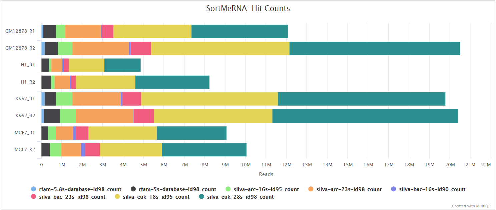

#### Bowtie2

<details markdown="1">
<summary>Output files</summary>

- `preprocessing/bowtie2_rrna/`
  - `*.bowtie2.log`: Log file generated by Bowtie2 with alignment statistics.
  - `*.fastq.gz`: If `--save_non_ribo_reads` is specified, FastQ files containing non-rRNA reads will be placed in this directory.

</details>

When `--ribo_removal_tool bowtie2` is specified, the pipeline uses [Bowtie2](https://github.com/BenLangmead/bowtie2) for alignment-based rRNA removal. Reads are aligned against rRNA reference sequences specified via `--ribo_database_manifest`, and reads that align to rRNA are filtered out. The unaligned reads (non-rRNA) are kept for downstream analysis.

#### RiboDetector

> [!WARNING]
> RiboDetector has known issues with ONNX multiprocessing that can cause hangs in containerized environments. We recommend using SortMeRNA or Bowtie2 instead. See [hzi-bifo/RiboDetector#61](https://github.com/hzi-bifo/RiboDetector/pull/61) for details.

<details markdown="1">
<summary>Output files</summary>

- `preprocessing/ribodetector/`
  - `*.log`: Log file generated by RiboDetector.
  - `*.fastq.gz`: If `--save_non_ribo_reads` is specified, FastQ files containing non-rRNA reads will be placed in this directory.

</details>

When `--ribo_removal_tool ribodetector` is specified, the pipeline uses [RiboDetector](https://github.com/hzi-bifo/RiboDetector) for machine learning-based rRNA detection. RiboDetector uses a pre-trained neural network to identify rRNA reads without requiring a reference database. This makes it particularly useful for organisms that lack well-characterized rRNA sequences, or when you want to avoid database licensing requirements. The tool automatically determines the appropriate read length from your data.

## Alignment

### STAR

<details markdown="1">
<summary>Output files</summary>

- `alignment/star/original`
  - `*.Aligned.out.bam`: If `--save_align_intermeds` is specified the original BAM file containing read alignments to the reference genome will be placed in this directory.
  - `*.Aligned.toTranscriptome.out.bam`: If `--save_align_intermeds` is specified the original BAM file containing read alignments to the transcriptome will be placed in this directory.
- `alignment/star/sorted`
  - `*.genome.sorted.bam`: Coordinate-sorted genome BAM file for each sample
  - `*.genome.sorted.bam.bai`: Index for coordinate-sorted genome BAM file for each sample
  - `*.transcriptome.sorted.bam`: Coordinate-sorted transcriptome BAM file for each sample
  - `*.transcriptome.sorted.bam.bai`: Index for coordinate-sorted transcriptome BAM file for each sample
- `alignment/star/log/`
  - `*.SJ.out.tab`: File containing filtered splice junctions detected after mapping the reads.
  - `*.Log.final.out`: STAR alignment report containing the mapping results summary.
  - `*.Log.out` and `*.Log.progress.out`: STAR log files containing detailed information about the run. Typically only useful for debugging purposes.
- `alignment/star/unmapped/`
  - `*.fastq.gz`: If `--save_unaligned` is specified, FastQ files containing unmapped reads will be placed in this directory.
- `alignment/star/sorted/samtools_stats/`
  - SAMtools `*.sorted.bam.flagstat`, `*.sorted.bam.idxstats` and `*.sorted.bam.stats` files generated from the sorted alignment files.

</details>

[STAR](https://github.com/alexdobin/STAR) is a read aligner designed for splice aware mapping typical of RNA sequencing data. STAR stands for *S*pliced *T*ranscripts *A*lignment to a *R*eference, and has been shown to have high accuracy and outperforms other aligners by more than a factor of 50 in mapping speed, but it is memory intensive. Using `--aligner star_salmon` is the default alignment and quantification option.

The STAR section of the MultiQC report shows a bar plot with alignment rates: good samples should have most reads as _Uniquely mapped_ and few _Unmapped_ reads.

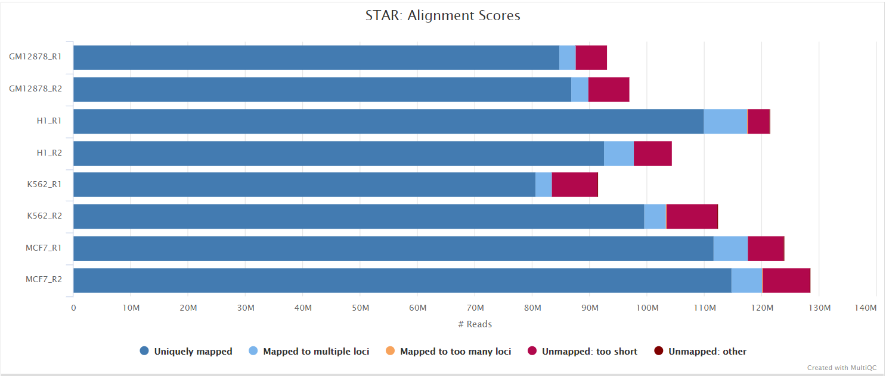

The original BAM files generated by the selected alignment algorithm are further processed with [SAMtools](http://samtools.sourceforge.net/) to sort them by coordinate, for indexing, as well as to generate read mapping statistics.

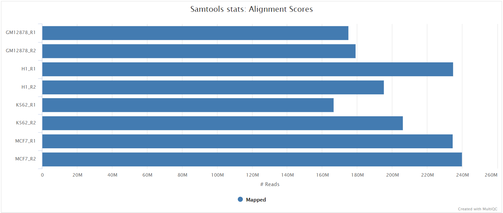

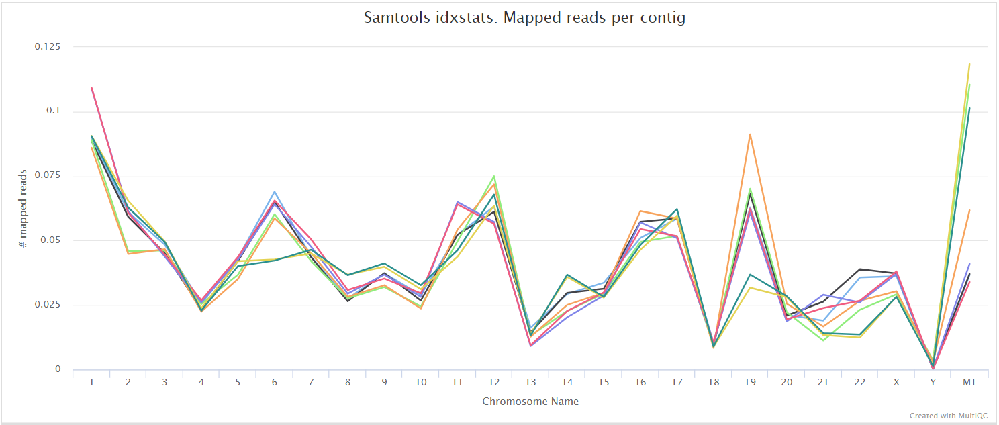

### UMI dedup

<details markdown="1">
<summary>Output files</summary>

- `alignment/star/deduplicated`
  - `<SAMPLE>.umi_dedup.sorted.bam`: If `--save_umi_intermeds` is specified the UMI deduplicated, coordinate sorted BAM file containing read alignments will be placed in this directory.
  - `<SAMPLE>.umi_dedup.sorted.bam.bai`: If `--save_umi_intermeds` is specified the BAI index file for the UMI deduplicated, coordinate sorted BAM file will be placed in this directory.
  - `<SAMPLE>.umi_dedup.sorted.bam.csi`: If `--save_umi_intermeds --bam_csi_index` is specified the CSI index file for the UMI deduplicated, coordinate sorted BAM file will be placed in this directory.
- `alignment/star/deduplicated/log/`
  - `*_edit_distance.tsv`: Reports the (binned) average edit distance between the UMIs at each position (UMI-tools only).
  - `*_per_umi.tsv`: UMI-level summary statistics (UMI-tools only).
  - `*_per_umi_per_position.tsv`: Tabulates the counts for unique combinations of UMI and position (UMI-tools only).
  - `*.log`: log from UMI deduplication tool.

The content of the files above is explained in more detail in the [UMI-tools documentation](https://umi-tools.readthedocs.io/en/latest/reference/dedup.html#dedup-specific-options).

</details>

After extracting the UMI information from the read sequence (see [UMI-tools extract](#umi-tools-extract)), the second step in the removal of UMI barcodes involves deduplicating the reads based on both mapping and UMI barcode information. UMI deduplication can be carried out either with [UMI-tools](https://github.com/CGATOxford/UMI-tools) or [UMICollapse](https://github.com/Daniel-Liu-c0deb0t/UMICollapse), set via the `umi_dedup_tool` parameter. The output BAM files are the same, though UMI-tools has some additional outputs, as described above. Either method will generate a filtered BAM file after the removal of PCR duplicates.

## Coverage tracks

The pipeline produces coverage tracks in bigWig format. In the case of stranded libraries, two tracks are created per sample - one for the coverage of the forward strand and one for the reverse strand. In the case of unstranded libraries, only one track is created.

- `coverage`
  - `<SAMPLE>.forward.bigWig`: Coverage on the forward strand (only created for stranded libraries)
  - `<SAMPLE>.reverse.bigWig`: Coverage on the reverse strand (only created for stranded libraries)
  - `<SAMPLE>.unstranded.bigWig`: Sum of coverage of forward and reverse strand (only created for unstranded libraries)

## Riboseq-specific QC

Read distribution metrics around annotated protein coding regions or based on alignments alone, plus related metrics.

### Ribo-TISH quality

<details markdown="1">
<summary>Output files</summary>

- `riboseq_qc/ribotish/`
  - `*_qual.txt`: text-format data on read distribution around annotated protein coding regions on user provided transcripts
  - `*_qual.pdf`: PDF-format representation of read distribution around annotated protein coding regions on user provided transcripts
  - `*.para.py`: P-site offsets for different reads lengths in python code dict format
  </details>

[Ribo-TISH](https://github.com/zhpn1024/ribotish) quality control analyzes the distribution of ribosome-protected fragment (RPF) reads around annotated coding sequences. Key metrics include read length distribution and reading frame periodicity, which are essential for assessing ribosome profiling data quality.

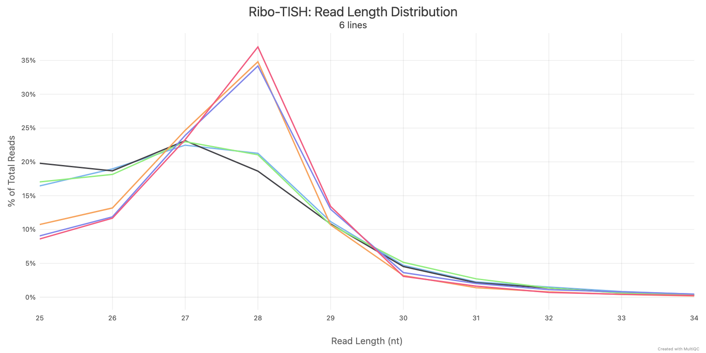

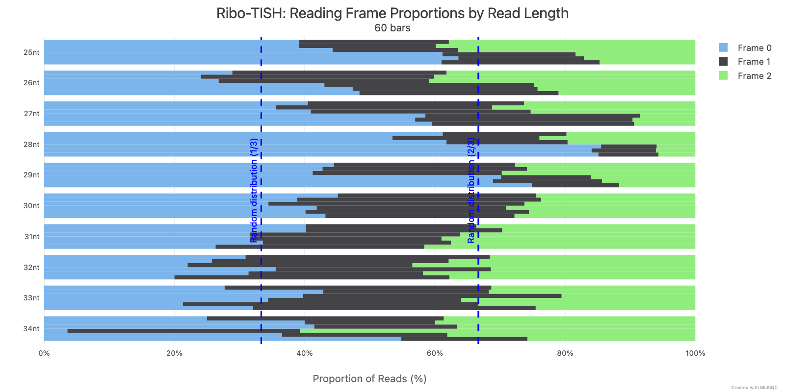

### Ribotricer detect-orfs QC outputs

Produced only when `--run_ribotricer true` is set. Ribotricer is opt-in because its ORF-score column is rank-unstable across biological replicates; its binary calls are still usable but its scores are excluded from cross-caller rank aggregation.

<details markdown="1">
<summary>Output files</summary>

- `riboseq_qc/ribotricer/`
  - `*_read_length_dist.pdf`: PDF-format read length distribution as quality control
  - `*_metagene_plots.pdf`: Metagene plots for quality control
  - `*_protocol.txt`: txt file containing inferred protocol if it was inferred (not supplied as input)
  - `*_metagene_profiles_5p.tsv`: Metagene profile aligning with the start codon
  - `*_metagene_profiles_3p.tsv`: Metagene profile aligning with the stop codon
  </details>

### RiboCode metaplots

<details markdown="1">
<summary>Output files</summary>

- `riboseq_qc/ribocode/`
  - `*_config.txt`: Configuration file containing P-site offsets for different read lengths
  - `*.pdf`: Metaplot showing read density around start and stop codons
  </details>

The metaplots step automatically determines which read lengths show 3-nucleotide periodicity and computes P-site offsets for each. These are written to the config file, which is then used by RiboCode for ORF detection.

:::note
If this step fails with `ERROR: metaplots created config file with no data`, it means none of the read lengths in your data passed the periodicity significance tests. This is a [known issue](https://github.com/xryanglab/RiboCode/issues/62) with RiboCode's default thresholds. You can relax them via:

```bash
--extra_ribocode_metaplots_args '-pv1 0.05 -pv2 0.05 -f0_percent 0.5'
```

Check the metaplots PDF output to verify that your data shows reasonable periodicity before relaxing thresholds further. The riboWaltz QC plots (frame distribution and metaprofiles) can also help you assess data quality.
:::

## Novel transcript discovery (StringTie / hybrid GTF)

When `--skip_stringtie false` is set, [StringTie](https://ccb.jhu.edu/software/stringtie/) is run per sample in reference-guided mode (preferring RNA-seq BAMs, falling back to Ribo-seq with tightened parameters) and the per-sample assemblies are merged. Alternatively, when `--novel_gtf` is supplied, StringTie is skipped and the user-supplied GTF is used as the novel-transcript source. Either source is then classified against the reference with [gffcompare](https://ccb.jhu.edu/software/stringtie/gffcompare.shtml), filtered to the user-configured class codes (`--stringtie_class_codes`, default `u`), optionally cleaned with an rRNA/repeat blacklist (`--rrna_blacklist`), and concatenated with the canonical reference to produce a hybrid annotation.

The hybrid GTF is published as a side product and exposed on the `hybrid_gtf` workflow channel. With no novel-transcript source configured, the channel equals the canonical backbone. Follow-on work in the modernisation plan wires the hybrid GTF into the genome-BAM ORF callers (Ribo-TISH `predict`, Ribotricer) under an opt-in flag.

<details markdown="1">
<summary>Output files</summary>

- `stringtie/`
  - `<SAMPLE>.denovo.transcripts.gtf`: Per-sample reference-guided assembly (only produced when StringTie ran; the `.denovo` prefix marks these as inputs to the merge step).
  - `stringtie_merge.gtf`: Merged annotation produced by `stringtie --merge` across all per-sample assemblies. Novel transcripts appear with `MSTRG.*` IDs. Absent when `--novel_gtf` is used.
  - `gffcompare/`: Full gffcompare output (`*.annotated.gtf`, `*.stats`, `*.tracking`, `*.loci`, etc.) classifying novel transcripts against the full reference annotation.
  - `novel_filtered.gtf`: Novel transcripts retained after the gffcompare class-code filter (default class `u` = intergenic only).
  - `novel_filtered.blacklisted.gtf`: Class-filtered novel transcripts after the optional rRNA/repeat blacklist intersect (only present when `--rrna_blacklist` is supplied).
  - `hybrid_reference.gtf`: Canonical reference + filtered novel transcripts, sorted by chromosome and start coordinate. Exposed as the `hybrid_gtf` workflow emit channel.

</details>

## ORF predictions

### Ribo-TISH predict

<details markdown="1">
<summary>Output files</summary>

- `orf_predictions/ribotish/`
  - `*_pred.txt` thresholded ORF predictions from Ribo-TISH
  - `*_all.txt` unthresholded ORF predictions from Ribo-TISH
  - `*_transprofile.py` RPF P-site profile for each transcript from Ribo-TISH
- `orf_predictions/ribotish_all/`
  - `allsamples_pred.txt` thresholded ORF predictions from Ribo-TISH ran over all samples at once
  - `allsamples_all.txt` unthresholded ORF predictions from Ribo-TISH ran over all samples at once
  - `allsamples_transprofile.py` RPF P-site profile for each transcript from Ribo-TISH ran over all samples at once
  </details>

### Ribotricer detect-orfs

<details markdown="1">
<summary>Output files</summary>

- `orf_predictions/ribotricer/`
  - `*_translating_ORFs.tsv` TSV with ORFs assessed as translating in the assocciated BAM file
  - `*_psite_offsets.txt`: If the P-site offsets are not provided, txt file containing the derived relative offsets
  </details>

### RiboCode

<details markdown="1">
<summary>Output files</summary>

- `orf_predictions/ribocode/`
  - `*.txt`: ORF predictions with coordinates, read counts, and translation scores
  - `*_collapsed.txt`: Collapsed ORF predictions removing redundant isoforms
  </details>

RiboCode uses the P-site offsets from the metaplots step to identify translated ORFs. If RiboCode fails with `Error, can not determine the P-site locations`, this means the metaplots config file had no valid entries. See the [metaplots troubleshooting note above](#ribocode-metaplots) for how to address this.

:::warning
The `-f0_percent`, `-pv1`, and `-pv2` parameters belong to the **metaplots** step, not to RiboCode itself. Pass them via `--extra_ribocode_metaplots_args`, not via RiboCode's own ext.args.
:::

If RiboCode is not needed for your analysis, you can skip it entirely with `--skip_ribocode`.

## P-site identification

### riboWaltz

P-sites are identified by passing transcriptome-level alignment BAM files to riboWaltz, producing the following outputs:

<details markdown="1">
<summary>Output files</summary>

- `ribowaltz/`
  - `*.best_offset.txt`: Text file with the extremity used for the offset correction step and the best offset for each sample
  - `*.psite_offset.tsv`: TSV file containing P-site offsets for each read length
  - `*.psite.tsv`: TSV file containing P-site transcriptomic coordinates and information for each alignment
  - `*.codon_coverage_rpf.tsv`: TSV file with codon-level RPF coverage for each transcript
  - `*.codon_coverage_psite.tsv`: TSV file with codon-level P-site coverage for each transcript
  - `*.cds_coverage_psite.tsv`: TSV file with CDS P-site in-frame counts for each transcript
  - `*nt_coverage_psite.tsv`: TSV file with CDS P-site in-frame counts for each transcript, excluding P-sites within defined distances to start and stop codons (defined by passing `--exclude_start` and `--exclude_stop` with the number of nucleotides)
- `ribowaltz/offset_plot/<SAMPLE>/`
  - `*.pdf`: P-site offset plots for each read length
- `ribowaltz/ribowaltz_qc/`
  - `*.length_distribution.pdf`: Distribution of read lengths per sample
  - `*.ends_heatmap.pdf`: Meta-heatmaps of read extremities around start and stop codons for each read length
  - `*.length_bins_for_psite.pdf`: Distribution of read lengths used to derive P-site offsets per sample
  - `*.psite_region.pdf`: P-site region distribution per sample
  - `*.metaprofile_psite.pdf`: P-site metaprofiles around start and stop codons per sample
  - `*.frames.pdf`: P-site frame distribution per sample
  - `*.frames_stratified.pdf`: P-site frame distribution for each read length per sample
  - `*.codon_usage.pdf`: Codon usage index per sample

  </details>

P-sites are identified by passing genome-level alignment BAM files to plastid, producing the following outputs:

<details markdown="1">
<summary>Output files</summary>

- `plastid/`
  - `*.filtered_rois.bed` and `*.filtered_rois.txt`: Position of CDS start for each gene in BED or TXT format; used for metagene analysis
  - `*_metagene_profiles.txt`: Matrix containing the distances of the 5' read ends to the CDS start position for each read length
  - `*_p_offsets.png`: Graphical illustrations of the metagene profiles
  - `*_p_offsets.txt`: Selected Optimal p-site offset for each read length

  </details>

## Quantification

Quantification is done by passing transcriptome-level alignment BAM files to Salmon, producing the following outputs:

<details markdown="1">
<summary>Output files</summary>

- `quantification/`
  - `tx2gene.tsv`: Tab-delimited file containing gene to transcripts ids mappings.
- `quantification/salmon/`
  - salmon.merged.gene_counts.tsv`: Matrix of gene-level raw counts across all samples.
  - salmon.merged.gene_tpm.tsv`: Matrix of gene-level TPM values across all samples.
  - salmon.merged.gene.rds`: RDS object that can be loaded in R that contains a [SummarizedExperiment](https://bioconductor.org/packages/release/bioc/html/SummarizedExperiment.html) container with the TPM (`abundance`), estimated counts (`counts`) and transcript length (`length`) in the assays slot for genes.
  - salmon.merged.gene_counts_scaled.tsv`: Matrix of gene-level library size-scaled counts across all samples.
  - salmon.merged.gene\_\_scaled.rds`: RDS object that can be loaded in R that contains a [SummarizedExperiment](https://bioconductor.org/packages/release/bioc/html/SummarizedExperiment.html) container with the TPM (`abundance`), estimated library size-scaled counts (`counts`) and transcript length (`length`) in the assays slot for genes.
  - salmon.merged.gene_counts_length_scaled.tsv`: Matrix of gene-level length-scaled counts across all samples.
  - salmon.merged.gene_length_scaled.rds`: RDS object that can be loaded in R that contains a [SummarizedExperiment](https://bioconductor.org/packages/release/bioc/html/SummarizedExperiment.html) container with the TPM (`abundance`), estimated length-scaled counts (`counts`) and transcript length (`length`) in the assays slot for genes.
  - salmon.merged.transcript_counts.tsv`: Matrix of isoform-level raw counts across all samples.
  - salmon.merged.transcript_tpm.tsv`: Matrix of isoform-level TPM values across all samples.
  - salmon.merged.transcript.rds`: RDS object that can be loaded in R that contains a [SummarizedExperiment](https://bioconductor.org/packages/release/bioc/html/SummarizedExperiment.html) container with the TPM (`abundance`), estimated isoform-level raw counts (`counts`) and transcript length (`length`) in the assays slot for transcripts.

  </details>

Raw outputs from Salmon are available for each sample:

<details markdown="1">
<summary>Output files</summary>

- `quantification/salmon/<SAMPLE>/`
  - `aux_info/`: Auxiliary info e.g. versions and number of mapped reads.
  - `cmd_info.json`: Information about the Salmon quantification command, version and options.
  - `lib_format_counts.json`: Number of fragments assigned, unassigned and incompatible.
  - `libParams/`: Contains the file `flenDist.txt` for the fragment length distribution.
  - `logs/`: Contains the file `salmon_quant.log` giving a record of Salmon's quantification.
  - `quant.genes.sf`: Salmon _gene_-level quantification of the sample, including feature length, effective length, TPM, and number of reads.
  - `quant.sf`: Salmon _transcript_-level quantification of the sample, including feature length, effective length, TPM, and number of reads.

  </details>

When the parameter `--te_quantification_method plastid_psite` is used, the following additional outputs are generated:

<details markdown="1">
<summary>Output files</summary>

- `quantification/inframe_psite/`
  - `gene_counts.tsv`: Count matrix containing alignment-based RNA-seq expression quantification and Ribo-seq quantification based on in-frame P-sites.

  </details>

## Translational efficiency

The pipeline supports two methods for translational efficiency analysis: anota2seq (default) and deltaTE. The method used depends on the `--translational_efficiency_method` parameter.

### anota2seq outputs

anota2seq produces the following outputs:

<details markdown="1">
<summary>Output files</summary>

- `translational_efficiency/anota2seq`
  - `*.total_mRNA.anota2seq.results.tsv`: anota2seq results for the 'total mRNA' analysis, describing differences in RNA levels across conditions for RNA-seq samples. See https://rdrr.io/bioc/anota2seq/man/anota2seqGetOutput.html for description of output columns.
  - `*.translated_mRNA.anota2seq.results.tsv`: anota2seq results for the 'translated mRNA' analysis, describing differences in RNA levels across conditions for Ribo-seq samples. See https://rdrr.io/bioc/anota2seq/man/anota2seqGetOutput.html for description of output columns.
  - `*.mRNA_abundance.anota2seq.results.tsv`: anota2seq results for the 'mRNA abundance' analysis, describing changes across conditions consistent between total mRNA and translated RNA (RNA-seq and Ribo-seq samples). See https://rdrr.io/bioc/anota2seq/man/anota2seqGetOutput.html for description of output columns.
  - `*.buffering.anota2seq.results.tsv`: anota2seq results for the 'buffering' analysis, describing stable levels of translated RNA (from Ribo-seq samples) across conditions, despite changes in total mRNA. See https://rdrr.io/bioc/anota2seq/man/anota2seqGetOutput.html for description of output columns.
  - `*.translation.anota2seq.results.tsv`: anota2seq results for the 'translation' analysis, describing differences in translation across conditions, being differences in translated RNA levels not explained by total RNA levels. See https://rdrr.io/bioc/anota2seq/man/anota2seqGetOutput.html for description of output columns.
  - `*.fold_change.png`: A fold change plot in PNG format, from anota2seq's anota2seqPlotFC() method.
  - `*.interaction_p_distribution.pdf`: The distribution of p-values and adjusted p-values for the omnibus interaction (both using densities and histograms). The second page of the pdf displays the same plots but for the RVM statistics if RVM is used.
  - `*.residual_distribution_summary.jpeg`: Summary plot for assessing normal distribution of regression residuals.
  - `*.residual_vs_fitted.jpeg`: QC plot showing residuals against fitted values.
  - `*.rvm_fit_for_all_contrasts_group.jpg`: QC plot showing the CDF of variance (theoretical vs empirical), all contrasts.
  - `*.rvm_fit_for_interactions.jpg`: QC plot showing the CDF of variance (theoretical vs empirical), for interactions.
  - `*.rvm_fit_for_omnibus_group.jpg`: QC plot showing the CDF of variance (theoretical vs empirical), for omnibus group.
  - `*.simulated_vs_obt_dfbetas_without_interaction.pdf`: Bar graphs of the frequencies of outlier dfbetas using different dfbetas thresholds.
  - `*.Anota2seqDataSet.rds`: Serialised Anota2seqDataSet object.
  - `*.R_sessionInfo.log`: dump of R SessionInfo

</details>

### deltaTE outputs

When using `--translational_efficiency_method deltate`, the pipeline produces the following outputs:

<details markdown="1">
<summary>Output files</summary>

- `translational_efficiency/deltate`
  - `*.total_mRNA.deltate.results.tsv`: DESeq2 results for RNA-seq analysis, describing differences in total mRNA levels across conditions.
  - `*.translated_mRNA.deltate.results.tsv`: DESeq2 results for Ribo-seq analysis, describing differences in ribosome-protected RNA levels across conditions.
  - `*.translation.deltate.results.tsv`: DESeq2 results for the interaction term, describing changes in translational efficiency across conditions.
  - `*.dtegs.deltate.genes.tsv`: Gene list of all differentially translated genes (DTEGs) with significant changes in translational efficiency.
  - `*.mRNA_abundance.deltate.genes.tsv`: Gene list of genes showing coordinated changes between RNA-seq and Ribo-seq without net translational efficiency changes (equivalent to anota2seq mRNA abundance).
  - `*.translation.deltate.genes.tsv`: Gene list of genes with pure translational regulation - Ribo-seq changes without RNA-seq changes (equivalent to anota2seq translation category).
  - `*.buffering.deltate.genes.tsv`: Gene list of genes with buffering effects where translation dampens RNA changes (equivalent to anota2seq buffering).
  - `*.intensified.deltate.genes.tsv`: Gene list of genes where translation amplifies RNA changes in the same direction (deltaTE-specific category).
  - `*.fold_change.png`: Scatter plot showing RNA-seq vs Ribo-seq log2 fold changes, colored by gene classification (harmonized with anota2seq visualization).
  - `*.interaction_p_distribution.png`: Histogram of interaction term adjusted p-values for assessing translational regulation significance patterns.
  - `*.pca_ribo.png`: PCA plot for Ribo-seq samples.
  - `*.pca_rna.png`: PCA plot for RNA-seq samples.
  - `*.heatmap.png`: Heatmap of top differentially translated genes (DTEGs).
  - `*.DESeqDataSet.rds`: Serialised DESeqDataSet object containing analysis results.
  - `*.R_sessionInfo.log`: R session information for reproducibility.

</details>

### Fold change plots

Both methods produce fold change plots that visualize the relationship between RNA-seq and Ribo-seq changes. The examples below were generated using the `test_full` profile on the same dataset, allowing direct comparison between methods.

**anota2seq fold change plot:**

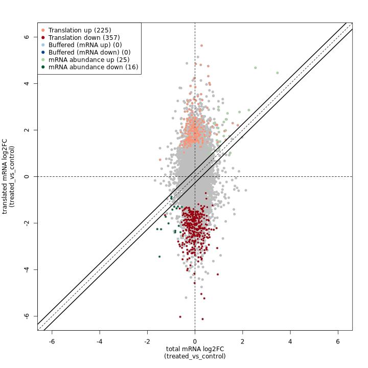

The anota2seq fold change plot shows total mRNA log2FC on the X-axis and translated mRNA log2FC on the Y-axis, with genes colored by their regulatory classification. The solid diagonal line represents equal changes in both data types.

_In the test dataset:_ The plot reveals 623 genes with significant translational regulation across several categories:

- **Translation down (357) / up (225)**: Genes showing pure translational regulation without corresponding RNA changes, appearing as vertical deviations from the diagonal
- **mRNA abundance down (16) / up (25)**: Genes with coordinated RNA and Ribo-seq changes, appearing along the diagonal
- **Buffered (mRNA down) (0) / (mRNA up) (0)**: Genes where translation dampens RNA changes (none detected in this dataset)

The predominance of translation-regulated genes (582 of 623) indicates that translational control is the dominant regulatory mechanism in this experimental system.

**deltaTE scatter plot:**

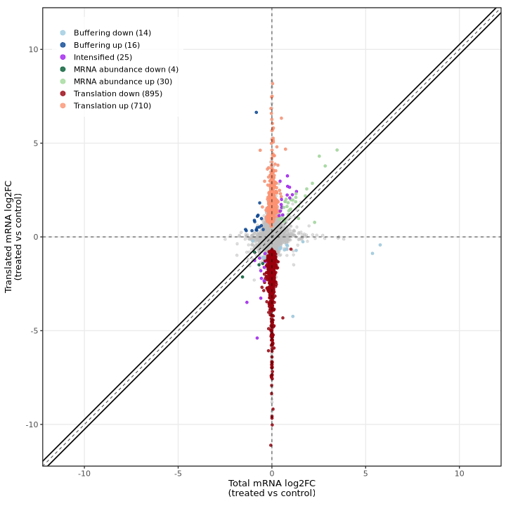

The deltaTE method produces a similar visualization showing total mRNA log2FC (RNA-seq) on the X-axis and translated mRNA log2FC (Ribo-seq) on the Y-axis, with genes colored by their classification. The diagonal dashed line represents equal changes in both data types.

_In the test dataset:_ The plot reveals 1,694 DTEGs across several categories:

- **Translation down (895) / up (710)**: Genes showing translational regulation without corresponding RNA changes, appearing as vertical deviations from the diagonal along the y-axis
- **mRNA abundance down (4) / up (30)**: Genes with coordinated RNA and Ribo-seq changes, appearing along the diagonal
- **Buffering down (14) / up (16)**: Genes where translation dampens RNA changes, appearing below the diagonal
- **Intensified (25)**: Genes where translation amplifies RNA changes, appearing above the diagonal

The striking vertical distribution of points (translation category) demonstrates that translational regulation is the dominant mode of gene expression control in this experimental system, with most changes occurring in Ribo-seq independently of RNA-seq.

### Diagnostic plots

Both methods provide diagnostic plots for quality control and model assessment:

#### anota2seq diagnostic plots

anota2seq produces several QC plots for assessing model fit and statistical assumptions.

**Residual distribution summary:**

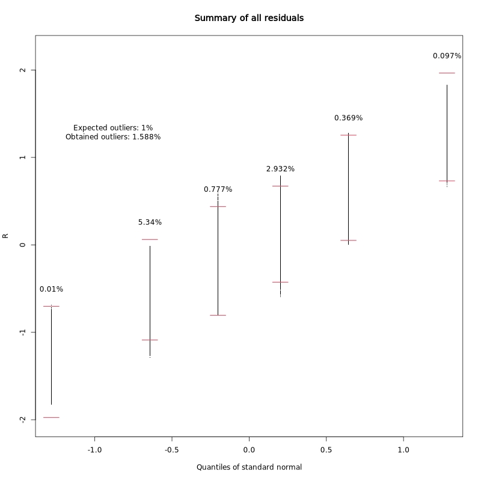

This plot summarizes the distribution of regression residuals across quantiles of the standard normal distribution. It helps assess whether the residuals follow the expected normal distribution, which is an assumption of the linear model.

_In the test dataset:_ The obtained outlier rate (1.588%) is close to the expected 1%, indicating the model assumptions are reasonably well met.

**Residuals vs fitted values:**

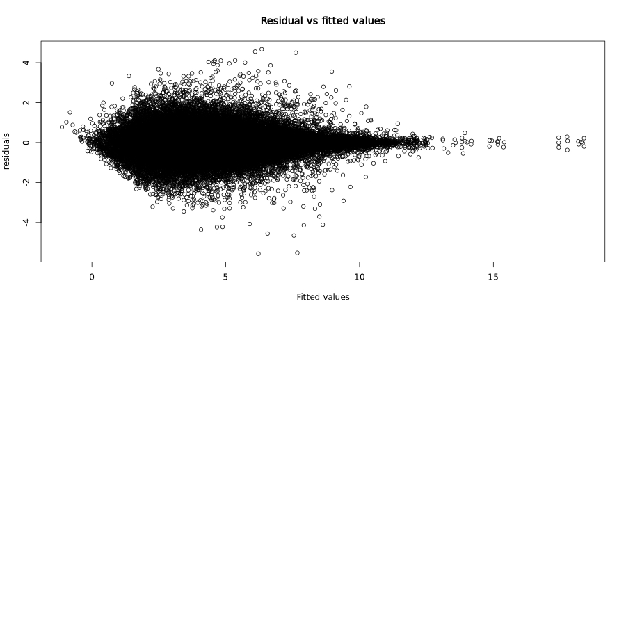

This classic diagnostic plot shows residuals plotted against fitted values. Ideally, residuals should be randomly scattered around zero with constant variance (homoscedasticity).

_In the test dataset:_ The residuals show a characteristic funnel shape with greater spread at lower fitted values, which is typical for count-based expression data. This heteroscedasticity is expected and accounted for by the RVM approach.

**RVM fit for interactions:**

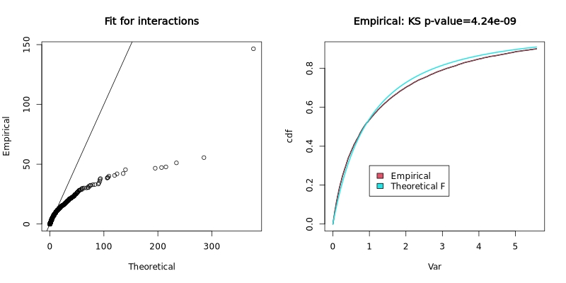

The Random Variance Model (RVM) fit plot shows how well the empirical variance distribution matches the theoretical F-distribution. The left panel shows a Q-Q plot of empirical vs theoretical quantiles, and the right panel shows the cumulative distribution functions with a Kolmogorov-Smirnov test p-value.

_In the test dataset:_ The KS p-value of 4.24e-09 indicates significant deviation from the theoretical distribution, suggesting the variance structure in this dataset differs from standard assumptions. This is not uncommon in real experimental data and the RVM approach helps account for such deviations.

#### deltaTE visualizations

The deltaTE method produces diagnostic plots for quality control and interpretation:

- **Fold change plot**: The main visualization showing RNA-seq vs Ribo-seq log2 fold changes, with genes colored by their deltaTE classification (mRNA_abundance, translation, buffering, intensified). This provides direct visual comparison with anota2seq's equivalent plot.
- **Interaction p-value distribution**: Histogram showing the distribution of adjusted p-values from the DESeq2 interaction term analysis.
- **PCA plots**: Principal component analysis plots for both Ribo-seq and RNA-seq samples to assess sample relationships and identify potential batch effects.
- **Heatmap**: Clustered heatmap of the most significantly regulated genes, showing expression patterns across samples.

**PCA plots:**

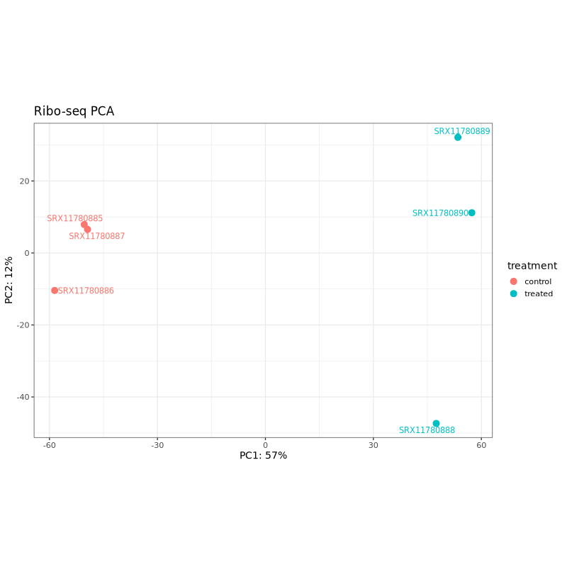

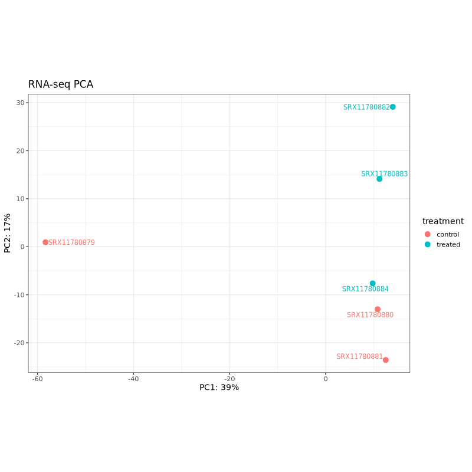

PCA plots help assess sample clustering and identify potential batch effects or outliers. In well-designed experiments, samples should cluster primarily by treatment condition rather than technical factors.

_In the test dataset:_ Both PCA plots show clear separation between control (coral) and treated (teal) samples along PC1, which captures 57% of variance for Ribo-seq and 39% for RNA-seq. This indicates that the treatment effect is the dominant source of variation in both data types. The treated samples cluster together on the right side of PC1 in both plots, while control samples are distributed on the left, with one control sample (SRX11780879 in RNA-seq, SRX11780886 in Ribo-seq) showing some separation from other controls along PC2.

**Expression heatmap:**

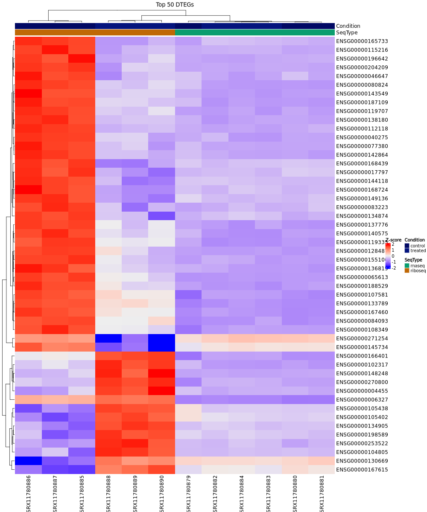

This clustered heatmap shows the expression patterns of the top 50 differentially translated genes (DTEGs) across all samples, with rows representing genes and columns representing samples. The color scale indicates normalized expression levels (Z-scores). Samples are annotated by condition (control/treated) and sequencing type (rnaseq/riboseq).

_In the test dataset:_ The heatmap reveals distinct expression patterns between control and treated samples. Samples cluster hierarchically first by condition (control vs treated), with Ribo-seq control samples on the far left showing predominantly high expression (red), and treated samples showing lower expression (blue/purple) for most genes. The top 50 DTEGs show strong coordinated downregulation in treated samples compared to controls, particularly evident in the Ribo-seq data, reflecting the predominance of translation-down regulation in this dataset.

#### Interpreting deltaTE diagnostic plots

**Interaction p-value distribution:**

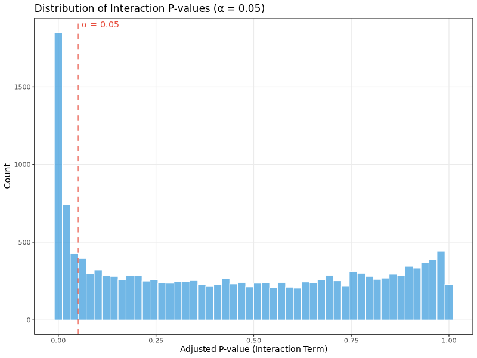

This histogram shows the distribution of adjusted p-values from the interaction term in the DESeq2 model, which tests for differences in translational efficiency between conditions. For well-powered experiments with genuine translational regulation:

- You should see a mixture of p-values with enrichment near 0 (significant genes) and relatively uniform distribution across higher p-values
- A completely uniform distribution suggests no translational regulation effects
- Heavy skewing toward 1.0 may indicate underpowered analysis or technical issues

_In the test dataset:_ The distribution shows strong enrichment of small adjusted p-values (large peak near 0), indicating widespread translational regulation in this experimental system. The dashed red line marks the significance threshold (α = 0.05). The analysis identified 1,694 differentially translated genes (DTEGs), with translational regulation being the dominant mode of gene expression control.

The deltaTE approach focuses on the key fold change visualization that directly shows the relationship between RNA and ribosome changes, making it easy to interpret translational regulation patterns. The **intensified** category (genes where translation amplifies RNA changes in the same direction) is unique to deltaTE and provides additional biological insights not available in anota2seq.

### MultiQC

<details markdown="1">
<summary>Output files</summary>

- `multiqc/`
  - `multiqc_report.html`: a standalone HTML file that can be viewed in your web browser.
  - `multiqc_data/`: directory containing parsed statistics from the different tools used in the pipeline.

</details>

[MultiQC](http://multiqc.info) is a visualization tool that generates a single HTML report summarising all samples in your project. Most of the pipeline QC results are visualised in the report and further statistics are available in the report data directory.

Results generated by MultiQC collate pipeline QC from supported tools i.e. FastQC, Cutadapt, SortMeRNA, STAR, RSEM, HISAT2, Salmon, SAMtools, Picard, RSeQC, Qualimap, Preseq and featureCounts. Additionally, various custom content has been added to the report to assess the output of dupRadar, DESeq2 and featureCounts biotypes, and to highlight samples failing a mimimum mapping threshold or those that failed to match the strand-specificity provided in the input samplesheet. The pipeline has special steps which also allow the software versions to be reported in the MultiQC output for future traceability. For more information about how to use MultiQC reports, see <http://multiqc.info>.

## Workflow reporting and genomes

### Reference genome files

<details markdown="1">
<summary>Output files</summary>

- `genome/`
  - `*.fa`, `*.gtf`, `*.gff`, `*.bed`, `.tsv`: If the `--save_reference` parameter is provided then all of the genome reference files will be placed in this directory.
  - `*.canonical_agat.longest.gff`, `*.canonical.gtf`: The canonical (one-transcript-per-gene) annotation backbone used by the ORF callers, riboWaltz, plastid P-site quantification and the translational-efficiency analysis. Only present when `--save_reference` is set and a `--canonical_gtf` was not supplied directly (i.e. derived via AGAT longest-isoform extraction from `--gtf`).
- `genome/index/`
  - `star/`: Directory containing STAR indices.
  - `hisat2/`: Directory containing HISAT2 indices.

</details>

A number of genome-specific files are generated by the pipeline because they are required for the downstream processing of the results. If the `--save_reference` parameter is provided then these will be saved in the `genome/` directory. It is recommended to use the `--save_reference` parameter if you are using the pipeline to build new indices so that you can save them somewhere locally. The index building step can be quite a time-consuming process and it permits their reuse for future runs of the pipeline to save disk space.

### Pipeline information

<details markdown="1">
<summary>Output files</summary>

- `pipeline_info/`
  - Reports generated by Nextflow: `execution_report.html`, `execution_timeline.html`, `execution_trace.txt` and `pipeline_dag.dot`/`pipeline_dag.svg`.
  - Reports generated by the pipeline: `pipeline_report.html`, `pipeline_report.txt` and `software_versions.yml`. The `pipeline_report*` files will only be present if the `--email` / `--email_on_fail` parameter's are used when running the pipeline.
  - Reformatted samplesheet files used as input to the pipeline: `samplesheet.valid.csv`.
  - Parameters used by the pipeline run: `params.json`.

</details>

[Nextflow](https://www.nextflow.io/docs/latest/tracing.html) provides excellent functionality for generating various reports relevant to the running and execution of the pipeline. This will allow you to troubleshoot errors with the running of the pipeline, and also provide you with other information such as launch commands, run times and resource usage.
